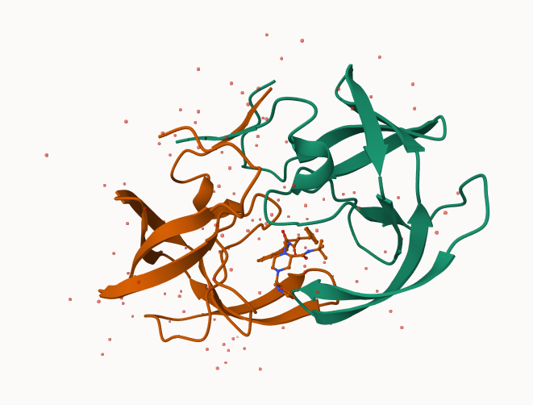
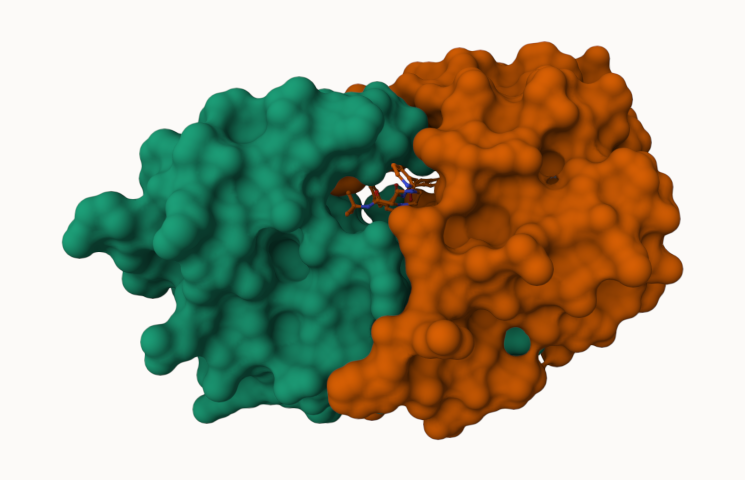

# Class10: Structural Bioinformatics (pt1)
Anyoleth Alarcon PID: A17347293

- [The PDB Database](#the-pdb-database)
- [2. Visualizing with Mol-star](#2-visualizing-with-mol-star)
- [3. Using the bio3d package in R](#3-using-the-bio3d-package-in-r)
- [Predicting functional motions of a single
  structure](#predicting-functional-motions-of-a-single-structure)

## The PDB Database

The main repository of biomolecular structure data is called the
[Protein Data Bank](https://www.rcsb.org) (PDB for short). It is the
second oldest database (after GenBank).

What is currently in the PDB? We can access current composition stats
[here](https://www.rcsb.org/stats)

``` r
stats <- read.csv("Data Export Summary.csv", row.names = 1)
head(stats)
```

                              X.ray     EM    NMR Multiple.methods Neutron Other
    Protein (only)          171,959 18,083 12,622              210      84    32
    Protein/Oligosaccharide  10,018  2,968     34               10       2     0
    Protein/NA                8,847  5,376    286                7       0     0
    Nucleic acid (only)       2,947    185  1,535               14       3     1
    Other                       170     10     33                0       0     0
    Oligosaccharide (only)       11      0      6                1       0     4
                              Total
    Protein (only)          202,990
    Protein/Oligosaccharide  13,032
    Protein/NA               14,516
    Nucleic acid (only)       4,685
    Other                       213
    Oligosaccharide (only)       22

> Q1: What percentage of structures in the PDB are solved by X-Ray and
> Electron Microscopy?

``` r
x <- stats$X.ray

# Substitute comma for nothing
y <- gsub(",", "", x)

# Convert to numeric
sum(as.numeric(y))
```

    [1] 193952

Turn this snippet into a function so I can use it any time I have this
comma problem (i.e. the other columns of this ‘stats’ table)

``` r
comma.sum <- function(x) {
  # Substitute comma for nothing
  y <- gsub(",", "", x)

  # Convert to numeric and sum
  return(sum(as.numeric(y)))

}
```

``` r
xray.sum <- comma.sum(stats$X.ray)
em.sum <- comma.sum(stats$EM)
total.sum <- comma.sum(stats$Total)
```

``` r
xray.sum/total.sum*100
```

    [1] 82.37223

``` r
em.sum/total.sum*100
```

    [1] 11.30648

> Q2: What proportion of structures in the PDB are protein?

``` r
protein.sum <- comma.sum(stats[1,7])
total.protein.sum <- comma.sum(stats[,7])
protein.sum/total.protein.sum*100
```

    [1] 86.2107

> Q3. Type HIV in the PDB website search box on the home page and
> determine how many HIV-1 protease structures are in the current PDB?

SKIPPED

## 2. Visualizing with Mol-star

Explore the HIV-1 protease structure with PDB code: `1HSG` Mol-star
homepage at: https://molstar.org/viewer/.






## 3. Using the bio3d package in R

The Bio3D package is focused on structural bioinformatics analysis and
allows us to read and analyze PDB (and related) data.

``` r
library(bio3d)
```

``` r
pdb <- read.pdb("1hsg")
```

      Note: Accessing on-line PDB file

``` r
pdb
```


     Call:  read.pdb(file = "1hsg")

       Total Models#: 1
         Total Atoms#: 1686,  XYZs#: 5058  Chains#: 2  (values: A B)

         Protein Atoms#: 1514  (residues/Calpha atoms#: 198)
         Nucleic acid Atoms#: 0  (residues/phosphate atoms#: 0)

         Non-protein/nucleic Atoms#: 172  (residues: 128)
         Non-protein/nucleic resid values: [ HOH (127), MK1 (1) ]

       Protein sequence:
          PQITLWQRPLVTIKIGGQLKEALLDTGADDTVLEEMSLPGRWKPKMIGGIGGFIKVRQYD
          QILIEICGHKAIGTVLVGPTPVNIIGRNLLTQIGCTLNFPQITLWQRPLVTIKIGGQLKE
          ALLDTGADDTVLEEMSLPGRWKPKMIGGIGGFIKVRQYDQILIEICGHKAIGTVLVGPTP
          VNIIGRNLLTQIGCTLNF

    + attr: atom, xyz, seqres, helix, sheet,
            calpha, remark, call

``` r
attributes(pdb)
```

    $names
    [1] "atom"   "xyz"    "seqres" "helix"  "sheet"  "calpha" "remark" "call"  

    $class
    [1] "pdb" "sse"

We can see atom data with `pdb$atom`:

``` r
head(pdb$atom)
```

      type eleno elety  alt resid chain resno insert      x      y     z o     b
    1 ATOM     1     N <NA>   PRO     A     1   <NA> 29.361 39.686 5.862 1 38.10
    2 ATOM     2    CA <NA>   PRO     A     1   <NA> 30.307 38.663 5.319 1 40.62
    3 ATOM     3     C <NA>   PRO     A     1   <NA> 29.760 38.071 4.022 1 42.64
    4 ATOM     4     O <NA>   PRO     A     1   <NA> 28.600 38.302 3.676 1 43.40
    5 ATOM     5    CB <NA>   PRO     A     1   <NA> 30.508 37.541 6.342 1 37.87
    6 ATOM     6    CG <NA>   PRO     A     1   <NA> 29.296 37.591 7.162 1 38.40
      segid elesy charge
    1  <NA>     N   <NA>
    2  <NA>     C   <NA>
    3  <NA>     C   <NA>
    4  <NA>     O   <NA>
    5  <NA>     C   <NA>
    6  <NA>     C   <NA>

``` r
head(pdbseq(pdb))
```

      1   2   3   4   5   6 
    "P" "Q" "I" "T" "L" "W" 

We can make quick 3D viz with the `view.pdb()` function.

``` r
library(bio3dview)
library(NGLVieweR)

 # view.pdb(pdb, backgroundColor = "pink", colorScheme = "sse")
```

``` r
sel <- atom.select(pdb, resno=25)

 # view.pdb(pdb, cols=c("green", "orange"),
  #       highlight = sel,
  #       highlight.style = "spacefill") |>
 # setRock()
```

## Predicting functional motions of a single structure

We can finish off today with a bioinformatics prediction of the
functional motions of a protein.

We will run a Normal Mode Analysis (NMA)

``` r
adk <- read.pdb("6s36")
```

      Note: Accessing on-line PDB file
       PDB has ALT records, taking A only, rm.alt=TRUE

``` r
adk
```


     Call:  read.pdb(file = "6s36")

       Total Models#: 1
         Total Atoms#: 1898,  XYZs#: 5694  Chains#: 1  (values: A)

         Protein Atoms#: 1654  (residues/Calpha atoms#: 214)
         Nucleic acid Atoms#: 0  (residues/phosphate atoms#: 0)

         Non-protein/nucleic Atoms#: 244  (residues: 244)
         Non-protein/nucleic resid values: [ CL (3), HOH (238), MG (2), NA (1) ]

       Protein sequence:
          MRIILLGAPGAGKGTQAQFIMEKYGIPQISTGDMLRAAVKSGSELGKQAKDIMDAGKLVT
          DELVIALVKERIAQEDCRNGFLLDGFPRTIPQADAMKEAGINVDYVLEFDVPDELIVDKI
          VGRRVHAPSGRVYHVKFNPPKVEGKDDVTGEELTTRKDDQEETVRKRLVEYHQMTAPLIG
          YYSKEAEAGNTKYAKVDGTKPVAEVRADLEKILG

    + attr: atom, xyz, seqres, helix, sheet,
            calpha, remark, call

``` r
m <- nma(adk)
```

     Building Hessian...        Done in 0 seconds.
     Diagonalizing Hessian...   Done in 0.39 seconds.

``` r
plot(m)
```


``` r
 # view.nma(m)
```

We can write-out a trajectory of the predicted dynamics and view this in
Mol-star.

``` r
mktrj(m, file="nma.pdb")
```
