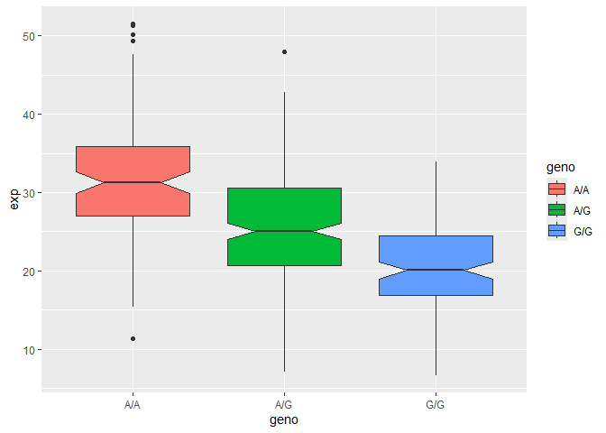

# Class12: HW Population Analysis
Anyoleth Alarcon

- [Homework Q13 and Q14](#homework-q13-and-q14)

## Homework Q13 and Q14

Section 4 is on *Population Scale Analysis*.

One sample is obviously not enough to know what is happening in a
population. You are interested in assessing genetic differences on a
population scale. So, you processed about ~230 samples and did the
normalization on a genome level. Now, you want to find whether there is
any association of the 4 asthma-associated SNPs (rs8067378…) on ORMDL3
expression.

Download file from class website. First column will be sample name,
second is genotype and third are the expression values.

How many samples do we have?

``` r
expr <- read.table("rs8067378_ENSG00000172057.6.txt")
head(expr)
```

       sample geno      exp
    1 HG00367  A/G 28.96038
    2 NA20768  A/G 20.24449
    3 HG00361  A/A 31.32628
    4 HG00135  A/A 34.11169
    5 NA18870  G/G 18.25141
    6 NA11993  A/A 32.89721

> Q13. Determine sample size for each genotype and corresponding median
> expression levels for each of these genotypes.

``` r
nrow(expr)
```

    [1] 462

``` r
table(expr$geno)
```


    A/A A/G G/G 
    108 233 121 

``` r
library(ggplot2)
```

> Q14. Generate boxplot. What could you infer from the relative
> expression value between A/A and G/G displayed in this plot? Does the
> SNP effect the expression of ORMDL3?

Let’s make a boxplot

``` r
ggplot(expr) + aes(x=geno, y=exp, fill=geno) +
  geom_boxplot(notch= TRUE)
```



A/A has a average higher expression value than G/G. YES.
