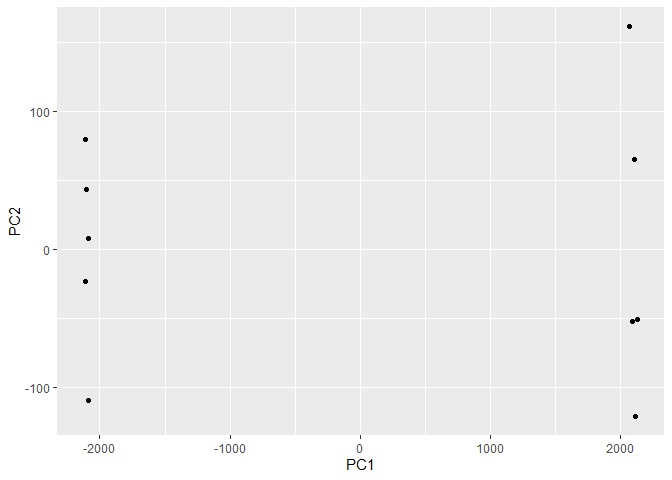
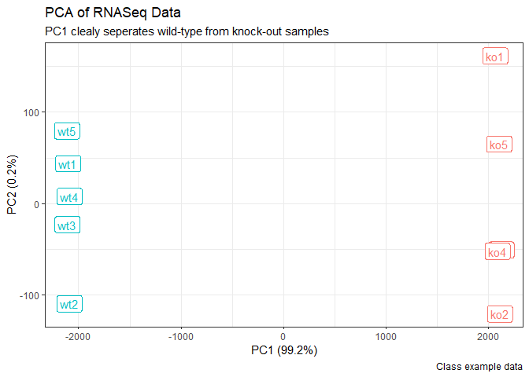

# Machine_Learning 1
Anyoleth Alarcon (A17347293)

## First up kmeans()

Demo of using kmeans() function in base R. First make up some data with
a known structure.

``` r
tmp <- c( rnorm(30, -3), rnorm(30, 3))
x <- cbind(x=tmp,y= rev(tmp))
plot(x)
```


Now we have some made up data in `x` let’s see how kmeans works with
this data

``` r
k <- kmeans(x, centers = 2, nstart = 20)
k
```

    K-means clustering with 2 clusters of sizes 30, 30

    Cluster means:
              x         y
    1  2.777703 -3.147598
    2 -3.147598  2.777703

    Clustering vector:
     [1] 2 2 2 2 2 2 2 2 2 2 2 2 2 2 2 2 2 2 2 2 2 2 2 2 2 2 2 2 2 2 1 1 1 1 1 1 1 1
    [39] 1 1 1 1 1 1 1 1 1 1 1 1 1 1 1 1 1 1 1 1 1 1

    Within cluster sum of squares by cluster:
    [1] 61.05665 61.05665
     (between_SS / total_SS =  89.6 %)

    Available components:

    [1] "cluster"      "centers"      "totss"        "withinss"     "tot.withinss"
    [6] "betweenss"    "size"         "iter"         "ifault"      

> Q. How many points are in each cluster?

``` r
k$size
```

    [1] 30 30

> Q. How do we get to the cluster membership/assignment?

``` r
k$cluster
```

     [1] 2 2 2 2 2 2 2 2 2 2 2 2 2 2 2 2 2 2 2 2 2 2 2 2 2 2 2 2 2 2 1 1 1 1 1 1 1 1
    [39] 1 1 1 1 1 1 1 1 1 1 1 1 1 1 1 1 1 1 1 1 1 1

> Q. What about cluster centers?

``` r
k$centers
```

              x         y
    1  2.777703 -3.147598
    2 -3.147598  2.777703

Now we got to the main results, let’s use them to plot our data with the
kmeans results.

``` r
plot(x, col=k$cluster)
points(k$centers, col="blue", pch=15)
```


## Now for hclust()

We will the same data `x` with the `hclust()`. In this case, `hclust()`
requires a distance matrix as input.

``` r
hc <- hclust(dist(x))
hc
```


    Call:
    hclust(d = dist(x))

    Cluster method   : complete 
    Distance         : euclidean 
    Number of objects: 60 

Let’s plot our hclust result

``` r
plot(hc)
```


To get our cluster membership vector we need to “cut” the tree with the
`cutree()`.

``` r
grps <- cutree(hc, h=8)
grps
```

     [1] 1 1 1 1 1 1 1 1 1 1 1 1 1 1 1 1 1 1 1 1 1 1 1 1 1 1 1 1 1 1 2 2 2 2 2 2 2 2
    [39] 2 2 2 2 2 2 2 2 2 2 2 2 2 2 2 2 2 2 2 2 2 2

Now plot our data with the hclust() results.

``` r
plot(x, col=grps)
```


# Principal Component Analysis (PCA)

## PCA of UK food data

Read data from website and try a few visualization

``` r
url <- "https://tinyurl.com/UK-foods"
x <- read.csv(url, row.names = 1)
x
```

                        England Wales Scotland N.Ireland
    Cheese                  105   103      103        66
    Carcass_meat            245   227      242       267
    Other_meat              685   803      750       586
    Fish                    147   160      122        93
    Fats_and_oils           193   235      184       209
    Sugars                  156   175      147       139
    Fresh_potatoes          720   874      566      1033
    Fresh_Veg               253   265      171       143
    Other_Veg               488   570      418       355
    Processed_potatoes      198   203      220       187
    Processed_Veg           360   365      337       334
    Fresh_fruit            1102  1137      957       674
    Cereals                1472  1582     1462      1494
    Beverages                57    73       53        47
    Soft_drinks            1374  1256     1572      1506
    Alcoholic_drinks        375   475      458       135
    Confectionery            54    64       62        41

``` r
cols <- rainbow(nrow(x))
barplot(as.matrix(x), col=cols)
```


``` r
barplot(as.matrix(x), col=cols, beside=TRUE)
```


``` r
pairs(x, col=cols)
```


PCA to the rescue!! The main base R PCA function is called `prcomp()`
and we will need to give it the transpose of our input data!

``` r
pca <- prcomp( t(x) )
```

There is a nice summary of how well PCA is doing

``` r
summary(pca)
```

    Importance of components:
                                PC1      PC2      PC3       PC4
    Standard deviation     324.1502 212.7478 73.87622 3.176e-14
    Proportion of Variance   0.6744   0.2905  0.03503 0.000e+00
    Cumulative Proportion    0.6744   0.9650  1.00000 1.000e+00

``` r
attributes(pca)
```

    $names
    [1] "sdev"     "rotation" "center"   "scale"    "x"       

    $class
    [1] "prcomp"

To make our new PCA plot (aka PCA score plot) we access `pca$x`

``` r
plot(pca$x[,1], pca$x[,2])
text(pca$x[,1], pca$x[,2], colnames(x))
```


Color up the plot

``` r
country_cols <- c("orange", "red", "blue", "green")
plot(pca$x[,1], pca$x[,2], xlab = "PC1", ylab = "PC2")
text(pca$x[,1], pca$x[,2], colnames(x), col = country_cols)
```


## PCA of RNA-Seq data

Read in data from website

``` r
url2 <- "https://tinyurl.com/expression-CSV"
rna.data <- read.csv(url2, row.names=1)
head(rna.data)
```

           wt1 wt2  wt3  wt4 wt5 ko1 ko2 ko3 ko4 ko5
    gene1  439 458  408  429 420  90  88  86  90  93
    gene2  219 200  204  210 187 427 423 434 433 426
    gene3 1006 989 1030 1017 973 252 237 238 226 210
    gene4  783 792  829  856 760 849 856 835 885 894
    gene5  181 249  204  244 225 277 305 272 270 279
    gene6  460 502  491  491 493 612 594 577 618 638

Another PCA summary

``` r
summary(pca)
```

    Importance of components:
                                PC1      PC2      PC3       PC4
    Standard deviation     324.1502 212.7478 73.87622 3.176e-14
    Proportion of Variance   0.6744   0.2905  0.03503 0.000e+00
    Cumulative Proportion    0.6744   0.9650  1.00000 1.000e+00

``` r
pca <- prcomp( t(rna.data))
plot(pca)
```


Do our PCA plot of this RNA-Seq data

``` r
plot(pca$x[,1], pca$x[,2], xlab="PC1", ylab="PC2")
```


``` r
plot(pca$x[,1], pca$x[,2], xlab="PC1", ylab="PC2",
     text(pca$x[,1], pca$x[,2], colnames(rna.data)))
```


Using ggplot to make the graph look a bit different

``` r
library(ggplot2)

df <- as.data.frame(pca$x)

# Our first basic plot
ggplot(df) + 
  aes(PC1, PC2) + 
  geom_point()
```



Now adding some color

``` r
# Add a 'wt' and 'ko' "condition" column
df$samples <- colnames(rna.data) 
df$condition <- substr(colnames(rna.data),1,2)

p <- ggplot(df) + 
        aes(PC1, PC2, label=samples, col=condition) + 
        geom_label(show.legend = FALSE)
p
```


Now just polishing it up…

``` r
## Variance captured per PC 
pca.var <- pca$sdev^2

## Percent variance is often more informative to look at 
pca.var.per <- round(pca.var/sum(pca.var)*100, 1)
pca.var.per
```

     [1] 99.2  0.2  0.1  0.1  0.1  0.1  0.1  0.1  0.1  0.0

``` r
p + labs(title="PCA of RNASeq Data",
       subtitle = "PC1 clealy seperates wild-type from knock-out samples",
       x=paste0("PC1 (", pca.var.per[1], "%)"),
       y=paste0("PC2 (", pca.var.per[2], "%)"),
       caption="Class example data") +
     theme_bw()
```


