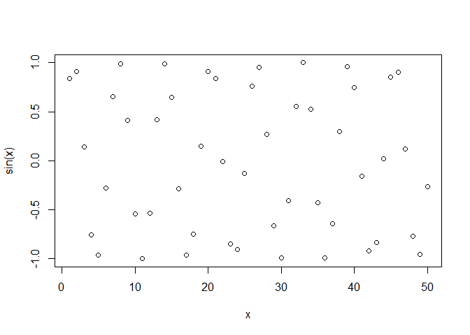
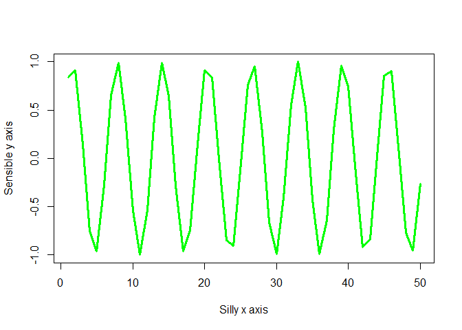

# Intro to R
Anyoleth Alarcon, A17347293

``` r
#My first R script
x<-1:50
plot(x,sin(x))
```



``` r
plot(x,sin(x),typ="l",col="green",lwd=3, 
     xlab="Silly x axis",ylab="Sensible y axis")
```


