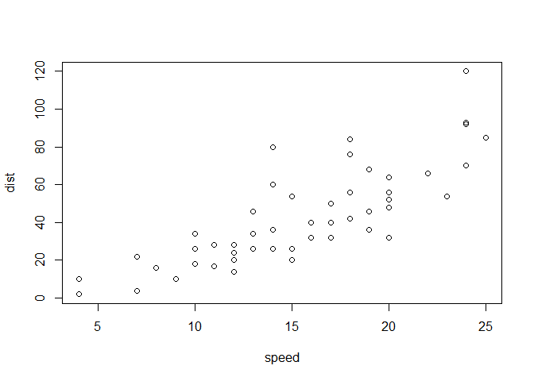
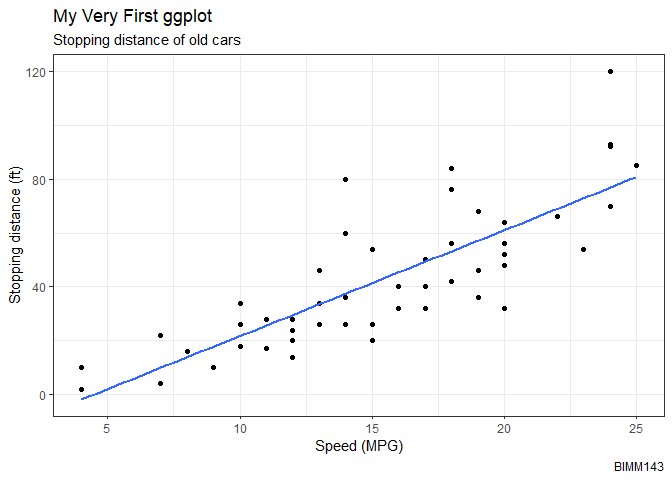
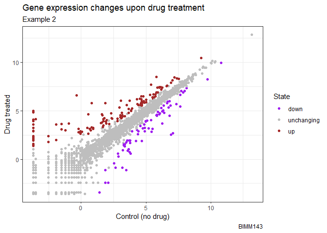
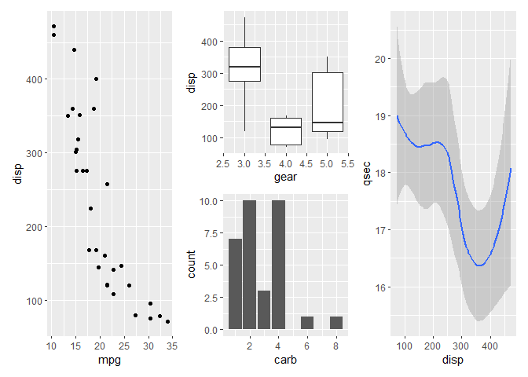
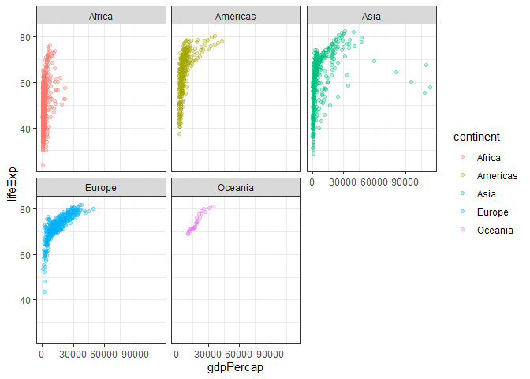

# Class 5: Data Visualization w/ ggplot
Anyoleth Alarcon PID: A17347293

- [Background](#background)
- [Gene expression plot](#gene-expression-plot)
  - [Custom color plot](#custom-color-plot)
- [Using different geoms](#using-different-geoms)

# Background

There are many graphic systems available in R. These include “base” R
and tons of add on packages like **ggplot2**

Let’s compare “base” and **ggplot2** briefly. We can use some example
data that is built-in with R called `cars`:

``` r
head(cars)
```

      speed dist
    1     4    2
    2     4   10
    3     7    4
    4     7   22
    5     8   16
    6     9   10

In base R I can just call `plot()`

``` r
plot(cars)
```



How can we do this with **ggplot2**

First we need to install the package. We do this
`install.packages("ggplot2")`. I only need to do this once and then it
will be available on my computer from then on, so you don’t install it
everytime you **Render**.

> Key point: I only install packages in the R console not with in quarto
> docs or R scripts.

Before I use any add-on package I must load it up with a call to
`library()`

``` r
library(ggplot2)
ggplot(cars)
```


Every ggplot has or needs at least 3 things:

- the **data** ( in our case `cars`)
- the **aes**thetics (how the data map to the plot)
- the **geom**etry that determine how the plot is drawn (lines, points,
  columns, densities, etc.)

``` r
ggplot(cars)+
  aes(x=speed, y=dist)+
  geom_point()
```


For “simple” plots ggplot is much more verbose than base R, but the
defaults are nicer and for complicated plots, it becomes much more
efficient and structured.

> Q. Add a line to show the relationship of speed to stopping distance
> (i.e. add another “layer”)

``` r
p <- ggplot(cars)+
  aes(x=speed, y=dist)+
  geom_point()+
  geom_smooth(se=FALSE, method="lm")
```

I can always save any ggplot object (i.e. plot) and then use it later
for adding more layers.

``` r
p
```

    `geom_smooth()` using formula = 'y ~ x'


> Q. Add a title and subtitle to the plot

``` r
p + labs(title = "My Very First ggplot", subtitle = "Stopping distance of old cars", caption = "BIMM143", x = "Speed (MPG)", y ="Stopping distance (ft)") + theme_bw()
```

    `geom_smooth()` using formula = 'y ~ x'



# Gene expression plot

Read input data into R

``` r
url <- "https://bioboot.github.io/bimm143_S20/class-material/up_down_expression.txt"
genes <- read.delim(url)
head(genes)
```

            Gene Condition1 Condition2      State
    1      A4GNT -3.6808610 -3.4401355 unchanging
    2       AAAS  4.5479580  4.3864126 unchanging
    3      AASDH  3.7190695  3.4787276 unchanging
    4       AATF  5.0784720  5.0151916 unchanging
    5       AATK  0.4711421  0.5598642 unchanging
    6 AB015752.4 -3.6808610 -3.5921390 unchanging

> Q. How many genes are in this silly little dataset?

``` r
nrow(genes)
```

    [1] 5196

> Q. How many columns are there?

``` r
ncol(genes)
```

    [1] 4

> Q. What are the column names?

``` r
colnames(genes)
```

    [1] "Gene"       "Condition1" "Condition2" "State"     

> Q. How many “up” regulated genes are there?

``` r
table(genes$State)
```


          down unchanging         up 
            72       4997        127 

## Custom color plot

> Q. Make a first plot of this data

``` r
ggplot(genes) + 
  aes(x=Condition1, y=Condition2, col=State) +
  scale_color_manual( values=c("purple", "gray", "brown"))+
  geom_point() + labs(title="Gene expression changes upon drug treatment", subtitle = "Example 2", caption="BIMM143", x="Control (no drug)", y="Drug treated") + theme_bw()
```



# Using different geoms

Let’s plot some aspects of the in-built `mtcars` dataset.

``` r
head(mtcars)
```

                       mpg cyl disp  hp drat    wt  qsec vs am gear carb
    Mazda RX4         21.0   6  160 110 3.90 2.620 16.46  0  1    4    4
    Mazda RX4 Wag     21.0   6  160 110 3.90 2.875 17.02  0  1    4    4
    Datsun 710        22.8   4  108  93 3.85 2.320 18.61  1  1    4    1
    Hornet 4 Drive    21.4   6  258 110 3.08 3.215 19.44  1  0    3    1
    Hornet Sportabout 18.7   8  360 175 3.15 3.440 17.02  0  0    3    2
    Valiant           18.1   6  225 105 2.76 3.460 20.22  1  0    3    1

> Q. Scatter plot of `mpg` vs. `disp`

``` r
w <- ggplot(mtcars)
```

``` r
s1 <- w + aes(x=mpg, y=disp) + geom_point()
```

> Q. Box plot of `gear` vs. `disp`

``` r
s2 <- w + aes(x=gear, y= disp, group=gear) + geom_boxplot()
```

> Q. Bar plot of `carb`

``` r
s3 <- w + aes(carb) + geom_bar()
```

> Q. Smooth of `disp` vs. `qsec`

``` r
s4 <- w + aes(disp, qsec) + geom_smooth()
```

I want to combine all these plots into one figure with multiple pannels.

We can use the **patchwork** package to do this.

``` r
library(patchwork)

((s1 |s2 /s3 |s4))
```

    `geom_smooth()` using method = 'loess' and formula = 'y ~ x'



``` r
ggsave(filename = "myplot.png", width=5, height=3)
```

    `geom_smooth()` using method = 'loess' and formula = 'y ~ x'

\#File location online

``` r
url <- "https://raw.githubusercontent.com/jennybc/gapminder/master/inst/extdata/gapminder.tsv"

gapminder <- read.delim(url)
```

> Keypoint: I installed gapminder with library under console.

> Q. How many countries are in this dataset?

``` r
length( table(gapminder$country))
```

    [1] 142

> Q. Plot GDPpercap vs. life expectancy coloe by continent

``` r
ggplot(gapminder) + aes(gdpPercap,lifeExp, col=continent) + geom_point(alpha=0.3) +
  facet_wrap(~continent) +
  theme_bw()
```


